# New-user onboarding walkthrough

This diagram describes the onboarding behavior implemented in the current web,
backend, email and native iOS code. It begins at either the public website or a
newly installed iPhone/iPad app and ends when the user reaches the live scoring
tool.

The Mermaid block can be copied directly into a Mermaid-compatible diagramming
tool. The personal and club paths intentionally remain separate until login:
personal registration is self-service, while a club submission is an enquiry
that requires manual follow-up and club creation.

```mermaid
flowchart TD
    WEB([Public website landing page]) --> WEBCTA[Choose Sign in or Want In]
    IOS([Download iPhone or iPad app]) --> IOSOPEN[Open app and reach Login]
    WEBCTA --> ENTRY[Hit n Score login and registration entry]
    IOSOPEN --> ENTRY

    ENTRY --> KNOWN{Does the user already have<br/>active login credentials?}
    KNOWN -- Yes --> LOGIN[Enter email and password]
    KNOWN -- No --> WANTIN[Open Want In / Join Hit n Score]

    subgraph REG[Registration choice]
        WANTIN --> TYPE{Personal use or club use?}
        TYPE -- Personal --> PFORM[Enter first name, surname, email<br/>and complete the human check]
        TYPE -- Club --> CFORM[Enter first name, surname, email,<br/>club name and human check]
    end

    subgraph PERSONAL[Personal self-service activation]
        PFORM --> PAPI[POST /register_interest<br/>use_type = personal]
        PAPI --> PVALID{Payload and anti-bot<br/>checks pass?}
        PVALID -- No --> PFIX[Show error and keep form<br/>available for correction]
        PFIX --> PFORM
        PVALID -- Yes --> PCREATE[Create or refresh:<br/>registered interest record,<br/>Personal Free organisation,<br/>owner membership, personal court<br/>and a two-hour password token]
        PCREATE --> PEMAIL[[Email: verification and<br/>password-setup link]]
        PCREATE --> PCONFIRM[On-screen confirmation:<br/>check email to continue]
        PEMAIL --> PLINK[Open web /help reset link]
        PLINK --> PEXPIRED{Token valid and<br/>not already used?}
        PEXPIRED -- No --> PRESET[Request another password-reset email]
        PRESET --> PEMAIL
        PEXPIRED -- Yes --> PPASS[Choose and confirm password<br/>minimum 8 characters]
        PPASS --> PACTIVATE[Mark email validated,<br/>approve owner membership,<br/>clear token and save password]
        PACTIVATE --> PSUCCESS[On-screen confirmation:<br/>password updated; user can sign in]
    end

    subgraph CLUB[Club enquiry and managed activation]
        CFORM --> CAPI[POST /register_interest<br/>use_type = club]
        CAPI --> CVALID{Payload and anti-bot<br/>checks pass?}
        CVALID -- No --> CFIX[Show error and keep form<br/>available for correction]
        CFIX --> CFORM
        CVALID -- Yes --> CPENDING[Store pending club enquiry]
        CPENDING --> CUSERMAIL[[Email to requester:<br/>club enquiry received]]
        CPENDING --> CADMINMAIL[[Email to Hit n Score team:<br/>new club enquiry details]]
        CPENDING --> CCONFIRM[On-screen confirmation:<br/>team will make contact]
        CADMINMAIL --> CREVIEW[Team reviews enquiry and<br/>contacts the requester]
        CREVIEW --> CPROCEED{Proceed with club setup?}
        CPROCEED -- No / not yet --> CHOLD[Remain pending or record<br/>the team's decision]
        CPROCEED -- Yes --> CSETUP[Root Admin creates the club,<br/>configures enabled sports and<br/>creates its first user membership]
        CSETUP --> CINVITE[[Email to club user:<br/>membership approval link]]
        CINVITE --> CAPPROVE{How is membership approved?}
        CAPPROVE -- User opens email link --> CHTML[Approval webpage confirms access<br/>and may redirect to login after 3 seconds]
        CAPPROVE -- Root Admin approves manually --> CACTIVE[Membership becomes approved]
        CHTML --> CACTIVE
        CACTIVE --> CPASSWORD{Does the user know a<br/>usable account password?}
        CPASSWORD -- Yes --> CREADY[Club credentials ready]
        CPASSWORD -- No --> CRESET[Use password-reset email<br/>to choose a password]
        CRESET --> CREADY
    end

    PSUCCESS --> RETURN[Return to the web login<br/>or reopen the mobile app]
    CREADY --> RETURN
    RETURN --> LOGIN

    subgraph AUTH[Sign-in and account selection]
        LOGIN --> ONLINE{Online and credentials valid?}
        ONLINE -- No --> LOGINERROR[Show sign-in error or<br/>offline explanation]
        LOGINERROR --> LOGIN
        ONLINE -- Yes --> PENDING{At least one approved<br/>membership available?}
        PENDING -- No --> WAIT[Login blocked:<br/>check approval email]
        WAIT --> LOGIN
        PENDING -- Yes --> CONFLICT{Already signed in on<br/>the same client type?}
        CONFLICT -- Yes --> REPLACE[Ask permission to sign out<br/>the older session and continue]
        REPLACE --> LOGIN
        CONFLICT -- No --> SESSION[Create 30-day server session]
        SESSION --> COUNT{More than one approved<br/>organisation or account?}
        COUNT -- Yes --> SELECT[Choose Personal account<br/>or club membership]
        COUNT -- No --> DASH[Dashboard is active]
        SELECT --> DASH
    end

    subgraph SCORE[Reach the scoring tool]
        DASH --> START[Select Start New Match]
        START --> SPORT[Choose an enabled sport:<br/>Squash, Racketball or Tennis]
        SPORT --> SETUP[Enter players and select format,<br/>court and sport-specific options]
        SETUP --> CREATE[POST /start_match]
        CREATE --> CHECKS{Session, organisation, sport<br/>and active-match checks pass?}
        CHECKS -- No --> SETUPERROR[Show setup error;<br/>correct details or resume active match]
        SETUPERROR --> SETUP
        CHECKS -- Yes --> MATCH[Create match and<br/>match_started event]
        MATCH --> OPEN[Open scoring screen]
        OPEN --> READY([Warm-up / first-server choices complete<br/>Live scoring tool ready])
    end

    classDef entry fill:#102235,stroke:#1688d4,color:#ffffff,stroke-width:2px;
    classDef action fill:#17212b,stroke:#1688d4,color:#ffffff;
    classDef decision fill:#2d2d30,stroke:#f05aa6,color:#ffffff,stroke-width:2px;
    classDef email fill:#17212b,stroke:#f0c419,color:#ffffff,stroke-width:2px;
    classDef success fill:#123d2a,stroke:#32d26f,color:#ffffff,stroke-width:2px;
    classDef warning fill:#4a3510,stroke:#f0c419,color:#ffffff;
    classDef error fill:#4a1f2a,stroke:#f05a6f,color:#ffffff;

    class WEB,IOS,ENTRY entry;
    class WEBCTA,IOSOPEN,LOGIN,WANTIN,PFORM,CFORM,PAPI,PCREATE,PCONFIRM,PLINK,PRESET,PPASS,CAPI,CPENDING,CCONFIRM,CREVIEW,CSETUP,CHTML,CRESET,RETURN,REPLACE,SELECT,SESSION,DASH,START,SPORT,SETUP,CREATE,MATCH,OPEN action;
    class KNOWN,TYPE,PVALID,PEXPIRED,CVALID,CPROCEED,CAPPROVE,CPASSWORD,ONLINE,PENDING,CONFLICT,COUNT,CHECKS decision;
    class PEMAIL,CUSERMAIL,CADMINMAIL,CINVITE email;
    class PACTIVATE,PSUCCESS,CACTIVE,CREADY,READY success;
    class CHOLD,WAIT warning;
    class PFIX,CFIX,LOGINERROR,SETUPERROR error;
```

## Logic in plain language

### 1. Both products share the same account

The website and native app are two clients of the same backend. Registration
started in the app still sends the user to the web password page from the email.
After activation, the same email and password work on both clients.

The marketing website itself is outside this repository. Its call-to-action
must link visitors to the deployed web login/registration page for the first
website branch of the diagram to work.

### 2. Personal registration uses the password email as verification

Personal registration does not wait for Root Admin approval. The backend creates
the Personal Free account structure first, but leaves the owner membership
pending until the emailed link is completed. The link expires after two hours.
Choosing a password both validates the email and approves the membership.

There is no separate "email verified" message sent afterward. Confirmation is
shown on the password page, and the user can then return to either login screen.
If the link expires, the existing password-reset flow can issue a new link.

### 3. Club registration is currently an enquiry, not account creation

A club submission produces two emails: a receipt to the requester and an admin
notification to the Hit n Score team. The team must then contact the requester,
create the club in Root Admin, configure it, and add the first user. Adding that
user creates a pending membership and sends a separate approval-link email.

An existing Hit n Score user keeps the password already associated with their
email. A genuinely new club user needs a password supplied/set during managed
setup, or can use the password-reset flow. The approval link approves access;
it does not itself ask the user to choose a password.

### 4. Login creates one shared session before account selection

The backend checks the password across memberships and exposes only approved
ones. If the same email belongs to several personal/club organisations, the
user chooses which association to enter. The returned server session lasts 30
days by default; the selected organisation controls the dashboard, permissions,
enabled sports, courts and matches that follow.

If another session already exists for the same client type, the user must
explicitly agree to replace it. First-time native login requires connectivity.

### 5. Scoring is available only after server-side checks

`Start New Match` loads setup for the selected account. Only enabled and fully
implemented sports are offered: Squash, Racketball and Tennis. The backend
rechecks the session, tenant and sport rather than trusting the screen. Personal
accounts may have only one active match; club court conflicts may result in a
scheduled match instead of immediately opening live scoring.

When creation succeeds, the backend stores the match plus a `match_started`
event. The client opens the sport-specific scoring screen, where warm-up and
first-server choices lead into point scoring.

## Review checkpoints before release

Use these questions while stepping through the diagram:

1. Does every public website call-to-action reach the deployed login/Want In
   page on desktop and mobile browsers?
2. Do the personal setup email and all club emails use production branding,
   sender identity, working HTTPS links and useful expiry/help wording?
3. Is it obvious in both clients that Personal is immediate but Club requires
   team contact?
4. Is the two-hour expiry and the route to request a replacement link clear?
5. Is the managed method for giving a brand-new club user their first password
   documented for the operations team?
6. After activation, can the user sign in on web and iOS, select the correct
   association, and see only the sports enabled for that account?
7. Can the user create a simple match and reach the scoring screen without
   needing undocumented administrator action?
